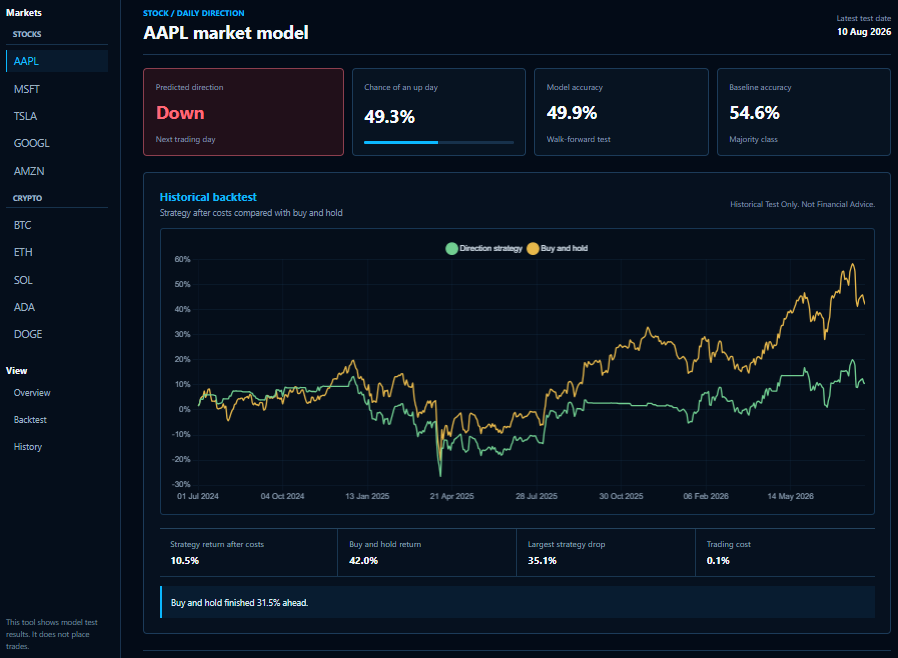
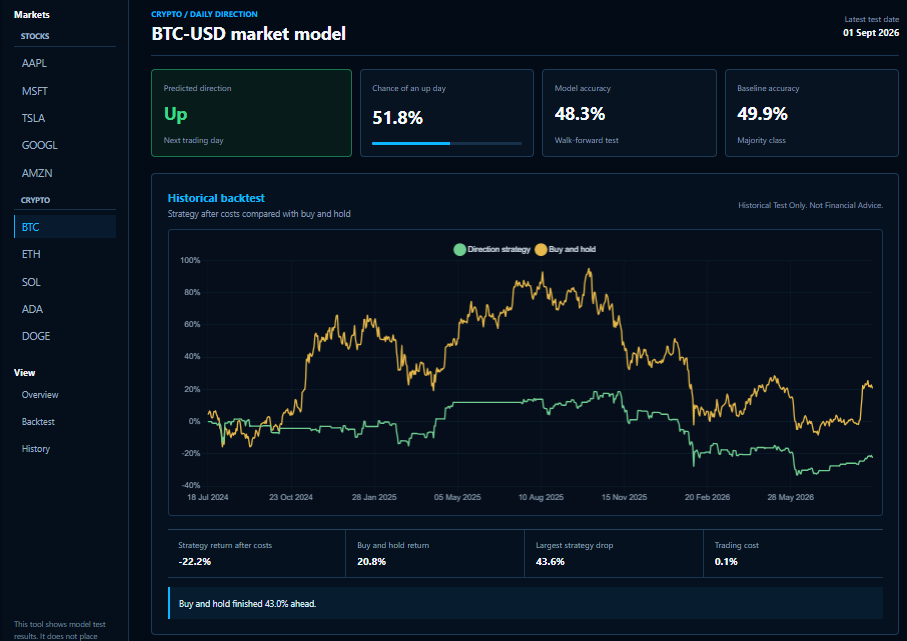
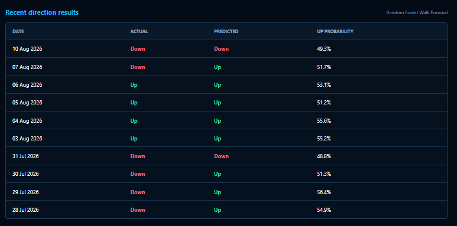
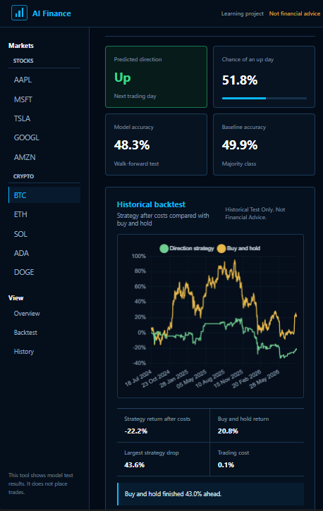

# AI in Finance v2
A learning project that uses historical market data to predict whether a stock or cryptocurrency may move up or down on the next trading day.

This project demonstrates data collection, data cleaning, feature creation, machine learning, walk-forward testing, baseline comparison, backtesting, API design, a React dashboard, and automated testing.

## Overview
The model does not try to predict an exact future price. It looks for patterns in past price and volume data, tests those patterns on later data, and compares the result with a simple baseline.

The project started as a university group project between four students. The work was split into AI and machine learning, frontend design, finding reliable market data, and testing, data input, and data sanitisation.

My main role in the group was testing, data input, and data sanitisation. I am now rebuilding the whole project by myself so I can improve it and learn how every part works.

## Current Features
- Download free daily market data with yfinance
- Support 5 stocks and 5 cryptocurrencies
- Check and clean downloaded data before it is used
- Create lagged return, moving average, volatility, volume, and price range features
- Train a Random Forest classifier
- Predict next-day direction as up or down
- Show the chance of an up day for the next prediction
- Use walk-forward testing so the evaluation stays in date order
- Compare the model with a majority-class baseline
- Backtest a simple predicted-up strategy against buy and hold
- Include a 0.1% trading cost in the backtest
- Show the largest strategy drop during the backtest
- List recent predicted and actual directions in a table
- Display results in a React dashboard that works on smaller screens
- Serve results to the dashboard through an Express API
- Include Python, server, and frontend tests

## Supported Assets
Stocks: AAPL, MSFT, TSLA, GOOGL, and AMZN

Crypto: BTC-USD, ETH-USD, SOL-USD, ADA-USD, and DOGE-USD

## Technologies
- Python
- yfinance
- Random Forest classifier
- React and Vite
- Node.js and Express
- Pytest
- PowerShell
- Git and GitHub

## Demonstration

### Stock dashboard

### Cryptocurrency dashboard

### Recent direction results

### Smaller screen layout

## Example Results
The screenshots show that the model does not beat simple approaches yet.

| Asset | Model accuracy | Baseline accuracy | Strategy return after costs | Buy and hold return |
| --- | --- | --- | --- | --- |
| AAPL | 49.9% | 54.6% | 10.5% | 42.0% |
| BTC-USD | 48.3% | 49.9% | -22.2% | 20.8% |

For both assets, the model scored lower than the majority-class baseline. Buy and hold also finished ahead of the direction strategy. For AAPL, buy and hold finished 31.5% ahead. For BTC-USD, it finished 43.0% ahead.

I included these results on purpose. Showing the baseline and buy and hold side by side makes it clear how the model really performs.

## Implementation Note
The target for each day records whether the next closing price went up or down. Features only use data from the current day and earlier, so the model does not see future prices.

Walk-forward testing trains the model on earlier dates and tests it on later dates. This matches how the model would be used in practice and avoids mixing future data into training.

Downloaded prices and generated results are ignored by Git. This keeps the repository small, and each user creates their own results locally.

## What I Learned
Through this project, I practised:

- Downloading and checking market data
- Cleaning data before training a model
- Creating features from price and volume data
- Training and testing a Random Forest classifier
- Using walk-forward testing to keep results in date order
- Comparing a model with a simple baseline
- Building a backtest that includes trading costs
- Building an Express API to serve results
- Building a React dashboard for stocks and crypto
- Writing tests for Python, server, and frontend code
- Reporting weak results honestly

## Planned Improvements
- Try more features and compare them against the current set
- Test other models against the Random Forest
- Add more assets
- Improve the backtest with more realistic costs and delays

## Model Limits
Market direction is hard to predict and past results do not guarantee future results. The model only learns from the features in this project. It does not understand company news, economic events, or sudden market changes.

The backtest is a simplified historical test. It does not include every cost, delay, or problem that would happen in real trading.

## Important Note
This project is for learning and portfolio work. It does not provide financial advice and does not place trades. It should not be used to make real investment decisions.

## Project Repository

[View the source code](https://github.com/ddawdry/ai-in-finance-remake)

## Development Disclosure
AI-assisted development was used for planning, debugging, and documentation review.

All behaviour was reviewed and tested locally.
