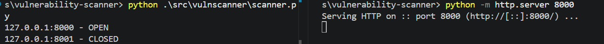

# Python Vulnerability Scanner

> Work in progress

A Python-based TCP port scanner built for authorised lab environments. The project demonstrates network scanning, input validation, structured results, error handling, and security-focused reporting.

## Current Features
- Scan multiple TCP ports on one IPv4 target
- Detect open and closed ports
- Validate IPv4 addresses
- Handle connection errors and timeouts
- Store findings as structured scan results

## Technologies
- Python
- TCP sockets
- PowerShell
- Git and GitHub

## Demonstration

The test above uses a temporary local web server on port 8000. No public or unauthorised systems were scanned.

## Implementation Note
Each result stores the target, port, status, and optional error. This structure will later support JSON reports, service detection, and automated tests.

## Planned Features
- Port-range parsing
- Service detection
- JSON reports
- Risk scoring
- Command-line interface
- Automated tests

## Responsible Use
This scanner is intended only for systems owned by the user or where explicit testing permission has been granted.

## Project Repository

[View the source code](https://github.com/ddawdry/vulnerability-scanner.git)

## Development Disclosure
AI-assisted development was used for planning, implementation support, and debugging. All behaviour was reviewed and tested in an authorised local environment.
