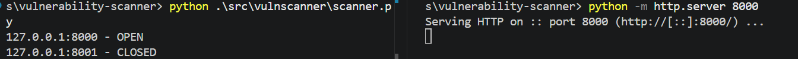
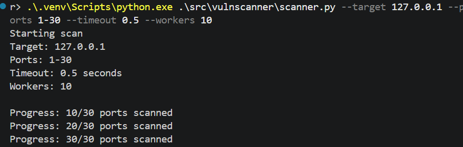
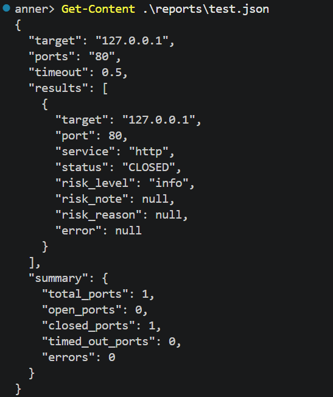
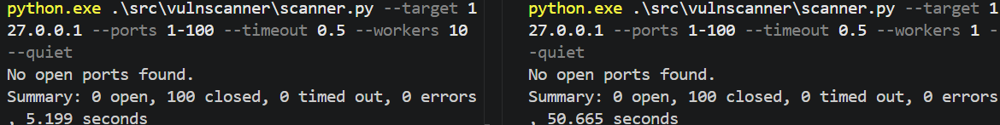
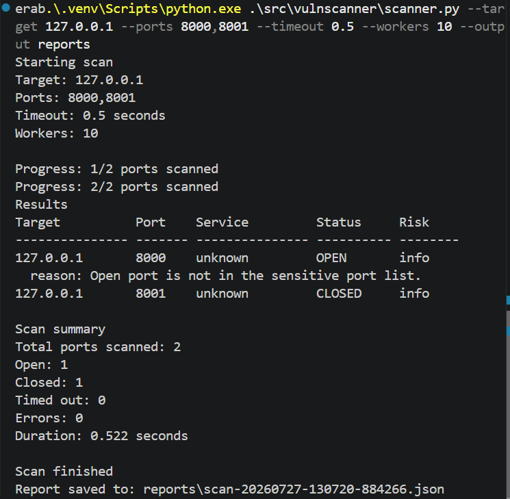
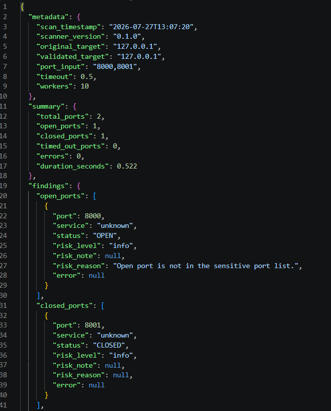
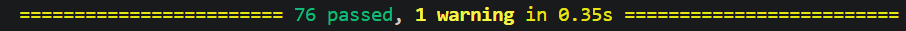

# Python Vulnerability Scanner
A beginner-friendly Python TCP port scanner built for localhost, home lab, and authorised cybersecurity practice.

This project demonstrates safe network scanning, input validation, structured results, error handling, JSON reporting, bounded concurrency, progress feedback, automated testing, and security-focused documentation.

## Overview
This scanner checks TCP ports on one IPv4 target and reports whether each port appears open, closed, timed out, or returned an error.

The project started as a simple localhost scanner and gradually expanded into a more complete portfolio project with cleaner output, JSON reports, testing, performance improvements, and Windows PowerShell documentation.

## Current Features
- Scan multiple TCP ports on one IPv4 target
- Detect open, closed, timed out, and error states
- Validate IPv4 addresses
- Validate port input, timeout values, worker limits, and output modes
- Support single ports, port ranges, comma-separated lists, and presets
- Use bounded concurrent scanning with a safe worker limit
- Keep concurrent results ordered by port
- Show simple progress feedback during normal scans
- Support quiet and verbose terminal output
- Store findings as structured scan results
- Generate JSON reports
- Include basic TCP service names where available
- Add simple risk labels and notes for selected open ports
- Handle connection errors and timeouts
- Include automated tests
- Include Windows PowerShell setup and usage documentation

## Technologies
- Python
- TCP sockets
- PowerShell
- JSON
- Pytest
- Git and GitHub

## Demonstration

### Controlled localhost scan

### Progress feedback

### JSON report output

### Performance comparison

### Final demo output

### Final JSON report

### Tests passing

## Implementation Note
Each scan result stores the target, port, status, service name, risk level, optional risk note, optional risk reason, and optional error.

This structure supports readable terminal output, grouped JSON findings, scan summaries, and future reporting improvements.

The scanner also uses a bounded worker limit so multiple ports can be checked at the same time without creating too many threads. Results are sorted by port before being displayed or saved, keeping output predictable even when concurrency is used.

## What I Learned
Through this project, I practised:

- Basic TCP socket scanning
- IPv4 and port validation
- Command-line argument handling
- Error and timeout handling
- Structuring Python data for reports
- Writing JSON report output
- Using bounded concurrency safely
- Keeping concurrent results ordered
- Writing automated tests
- Documenting safe cybersecurity tooling

## Planned Improvements
- Additional service and risk analysis
- More report formats
- Expanded safe lab examples
- Packaging improvements for easier installation

## Responsible Use
This scanner is intended only for localhost, owned systems, home labs, or environments where explicit testing permission has been granted.

It does not include code for gaining access to systems, brute forcing logins, hidden scanning, or scanning targets without permission.

Open ports are treated as review points, not confirmed vulnerabilities.

## Project Repository

[View the source code](https://github.com/ddawdry/vulnerability-scanner)

## Development Disclosure
AI-assisted development was used for planning, debugging, and documentation review.

All behaviour was reviewed and tested in an authorised local environment.
